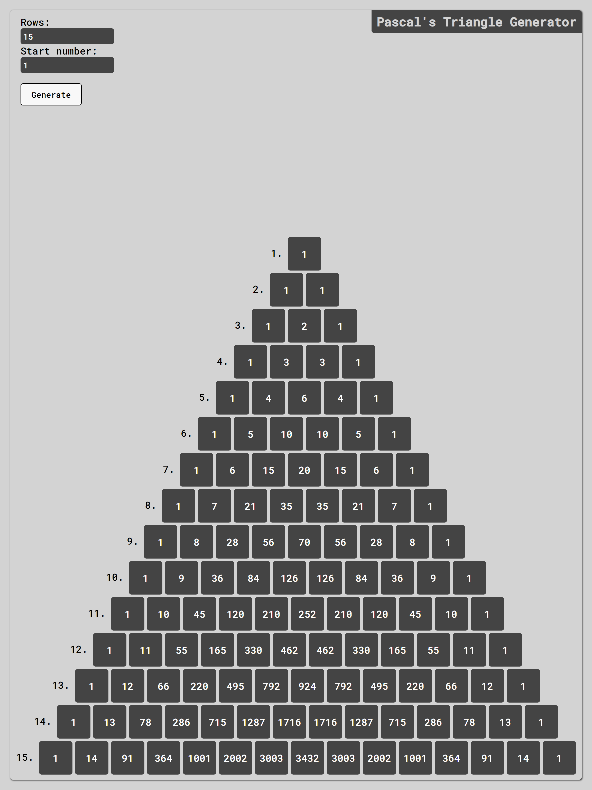

# Pascals Triangle Generator

This is simple app based on algorithm challenge from [Exrecism](https://exercism.org/) free coding platform.
In recent time I like to take this little challenges and build UI for them and make them functional.
You can generate [Pascal's triangle](https://en.wikipedia.org/wiki/Pascal%27s_triangle) with max row number up to 57 and max number value limited to javascript's Number.MAX_SAFE_INTEGER static data property.